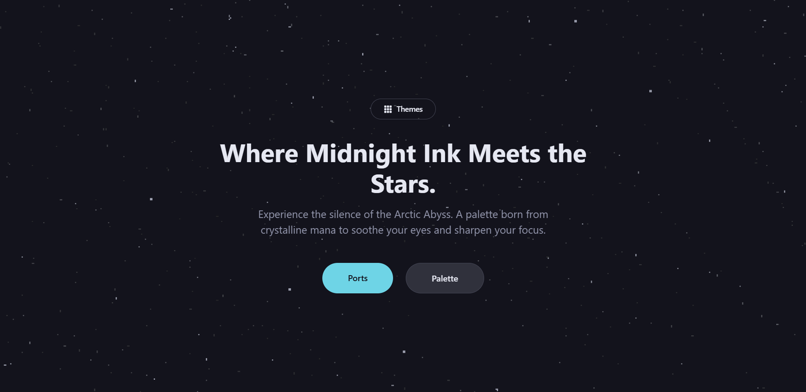

# Glacier Site

Glacier Site adalah proyek frontend untuk situs Glacier, dibangun dengan **Vue 3**, **TypeScript**, dan **Vite**, dengan sistem tema dan palet warna yang dapat digunakan ulang di berbagai proyek (ports).

Aplikasi ini menampilkan:

- Halaman utama (`/`) dengan layout khusus tanpa navbar/footer.
- Halaman **Palette** (`/palette`) dengan:
  - **Collections** – koleksi warna siap pakai.
  - **Potions** – detail tiap warna lengkap dengan representasi HEX, RGB, dan HSL.
- Halaman **Ports** (`/ports`) yang menampilkan daftar proyek terkait (seperti konfigurasi untuk Cava, tmux, Rofi, Foot, Ghostty, Alacritty, dll).
- **Theme switcher** (Zero, Mist, Peak) yang tersimpan di `localStorage` (`glacier-theme`).
- Sistem styling modular berbasis **SCSS** dengan variables, mixins, dan utilities.

---

## Screenshots



---

## Tech Stack

- [Vue 3](https://vuejs.org/) + `<script setup>` SFC
- [TypeScript](https://www.typescriptlang.org/)
- [Vite](https://vitejs.dev/)
- [Vue Router 5](https://router.vuejs.org/)
- [SCSS](https://sass-lang.com/)
- [GSAP](https://greensock.com/gsap/) (disiapkan untuk animasi)
- [Three.js](https://threejs.org/) (disiapkan untuk grafis 3D/WebGL)
- Deploy configuration: **Vercel** (`vercel.json` dengan SPA rewrite ke `index.html`)

---

## Fitur Utama

### 1. Routing

Dikonfigurasi di `src/router/index.ts`:

- `/` – `Home.vue`
  - `meta: { hideNavbar: true, hideFooter: true }`
- `/palette` – `Palette.vue`
  - Redirect default ke `/palette/collections`
  - Child routes:
    - `/palette/collections` – `Collections.vue`
    - `/palette/potions` – `Potions.vue`
- `/ports` – `Ports.vue`

### 2. Theme System

Komponen **ThemeSwitcher** (`src/components/Navbar/ThemeSwitcher.vue`):

- Tema tersedia: `zero`, `mist`, `peak`
- Menyimpan preferensi tema di `localStorage` (`glacier-theme`)
- Men-set atribut `data-theme` pada `document.documentElement` untuk dipakai di SCSS/CSS

### 3. Ports

Data ports disimpan di `src/module/ports.ts`:

- `description`: deskripsi singkat Glacier
- `categories`:
  - `music`
  - `app`
  - `terminal`

Masing-masing berisi daftar item dengan:

- `name`
- `icon` (key ke `src/module/icons.ts`)
- `repo` (URL GitHub project terkait)

### 4. SCSS Design System

Entry point SCSS: `src/assets/scss/main.scss`

- Menggunakan dan mem-forward:
  - `variables`
  - `mixins`
- Meng-include base styles:
  - `./base/reset`
  - `./base/base`
  - `./base/typography`
- Utilities:
  - `spacing`
  - `colors`
  - `typography` (alias `typography-utils`)
  - `layout`

Beberapa mixin penting dapat dilihat di `src/assets/scss/_mixins.scss`, seperti:

- `respond-to` – helper breakpoint responsif
- `flex-center`, `flex-between`, `flex-column` – utilitas flexbox
- `text-truncate`, `line-clamp` – kontrol teks
- `interactive` – state hover/focus untuk elemen interaktif
- `custom-scrollbar` – styling scrollbar
- `glass` – efek glassmorphism
- `container` – layout container responsif

Konfigurasi Vite (`vite.config.ts`) menambahkan:

- Alias `@` → `src`
- Inject SCSS global:
  - `src/assets/scss/variables`
  - `src/assets/scss/mixins`

---

## Struktur Proyek (Ringkas)

```text
.
├─ index.html
├─ package.json
├─ vite.config.ts
├─ vercel.json
├─ tsconfig*.json
└─ src
   ├─ main.ts
   ├─ App.vue
   ├─ router/
   │  └─ index.ts
   ├─ module/
   │  ├─ icons.ts
   │  └─ ports.ts
   ├─ assets/
   │  └─ scss/
   │     ├─ main.scss
   │     ├─ _mixins.scss
   │     └─ ...
   └─ components/
      ├─ Home/
      ├─ Palette/
      │  ├─ Palette.vue
      │  ├─ Collections.vue
      │  └─ Potions.vue
      ├─ Ports/
      │  ├─ Ports.vue
      │  └─ PortsHeader.vue
      └─ Navbar/
         ├─ Navbar.vue
         └─ ThemeSwitcher.vue
```

---

## Menjalankan Proyek

Pastikan sudah menginstall **Node.js** dan **pnpm** (atau npm/yarn).

### 1. Clone Repo

```bash
git clone https://github.com/glacier-s/glacier-site.git
cd glacier-site
```

### 2. Install Dependencies

Menggunakan pnpm (disarankan, karena ada `pnpm-lock.yaml`):

```bash
pnpm install
```

Atau dengan npm:

```bash
npm install
```

### 3. Development Server

```bash
pnpm dev
# atau
npm run dev
```

Buka alamat yang ditampilkan di terminal (biasanya `http://localhost:5173`).

### 4. Build untuk Production

```bash
pnpm build
# atau
npm run build
```

### 5. Preview Build

```bash
pnpm preview
# atau
npm run preview
```

---

## Deployment

Proyek ini dikonfigurasi untuk deployment di **Vercel** sebagai Single Page Application:

- File `vercel.json`:

```json
{
  "rewrites": [{ "source": "/(.*)", "destination": "/index.html" }]
}
```

Artinya semua path akan di-serve oleh `index.html`, sehingga routing sisi-klien (Vue Router) dapat berjalan dengan benar.

---

## Kontribusi

Jika ingin ikut mengembangkan Glacier Site:

1. Fork repository ini
2. Buat branch baru untuk fitur/bugfix:
   ```bash
   git checkout -b feat/nama-fitur
   ```
3. Commit perubahan dengan pesan yang jelas
4. Push ke branch tersebut
5. Buka Pull Request ke branch `main`
